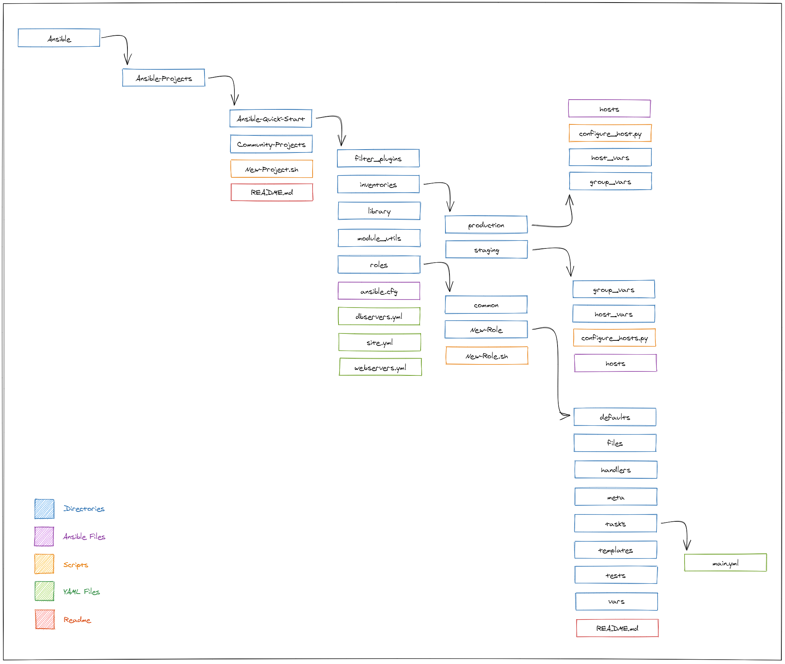
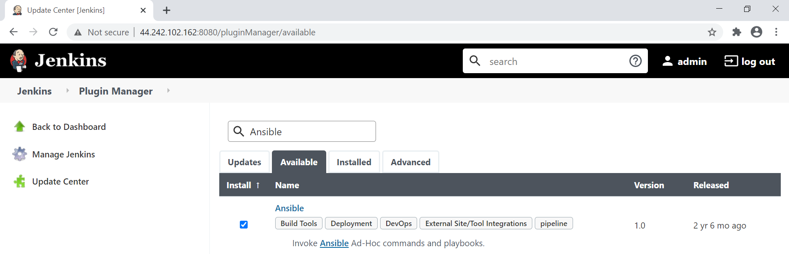

# Develop First, Deploy Later
## Ansible-Quick-Start.sh
This script creates a pre-configured developer environemt utilizing Docker containers to house cutting edge automation software. The services include automation applications such as ansible and jenkins and respective Community Projects created by contributers to the platform. The services are aimed towards lessening the spin up time of production environments and encourage mobile collaboration within automation/pipelining libraries. All services are easily accessable via browser due to the container and host shared file system. All edits are possible via virtual studio code in your web browser allowing for off prem collaboration and usablility.

## Features
- **Ansible Quick Start directory structure contains best practice environment for horizontal scaling**

- Virtual Studio Code allows access and collaboration from any machine via web browser

- Jenkins continuous integration suite shares the same file system as the other automation services

## Centos Distributions ONLY

## Usage
### Initial Setup
`bash <(curl -fsSL https://raw.githubusercontent.com/teo1927/Ansible/master/Ansible-Quick-Start.sh)`
### Internal Ansible Scripts
#### New Project
`bash New-Project.sh <Project_Name>`
#### New Role
`bash New-Role.sh <Role_Name>`
#### Host Configuration
`python3 configure_hosts.py`
## Requisites
1. Root Privleges
2. Centos Operating System
3. Internet Connection
